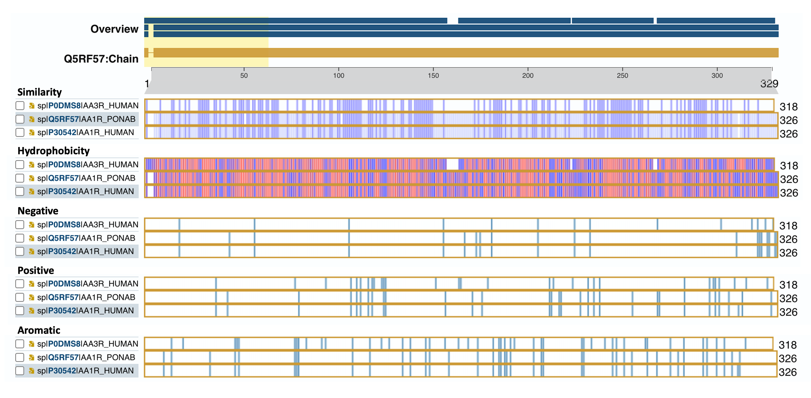
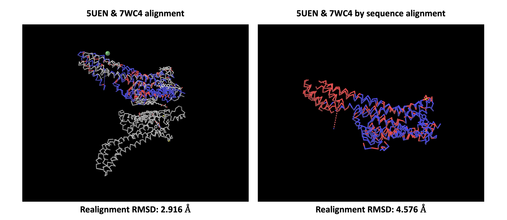

{
   "cell_type": "markdown",
   "metadata": {},
   "source": [
    "\n",
    "# Title\n",
    "\n",
    "### Introduction\n",
    "\n",
    "The human body holds a complex network of various signaling receptors that are involved in a wide range of physiological processes. Amongst them, the adenosine A1 receptor (A1R), a G-protein coupled receptor (GPCR) family, is a pivotal mediator. This receptor is predominantly expressed in the brain, heart, and vasculature, and plays a crucial role in modulating neurotransmission, neuronal activity, and cardiovascular homeostasis.1 Considering its involvement in these processes, A1R has shown to be involved in numerous disorders, including neurological and cardiovascular conditions.2,3 For instance, chronic agonistic activation of A1R has been linked with A1R-dependent accumulation of a-synuclein, which on long-term promotes neurodegeneration.4,5 Consequently, A1R has been suggested as a potential target in neurodegenerative disorders such as Parkinson’s disease.6 Furthermore, the implications of A1R overexpression also extend to cardiovascular conditions like ischemic strokes. Activation of the A1 receptor during ischemic events has shown to aggravate neuronal damage and lead to increased infarct size.7 Thus, the use of A1 receptor antagonists may be a potential treatment option to alleviate the detrimental effects of an ischemic stroke.\n",
    "\n",
    "1.\tDescribe the target (your report should contain at least the following information):\n",
    "-\tPathology (why are we interested in the target?)\n",
    "-\tClinical drugs available (which drugs are on the market)\n",
    " \tAlso use ATC information to further describe the drugs. \n",
    "-\tProtein information (what family of proteins is the target a member off, where is it located in the body?)\n",
    "\n",
    "### Related proteins (off-targets), based on sequence\n",
    "\n",
    "The A1R expressed in humans has an Accesion number of P30542, and an PDB ID of 5UEN. Based on the sequence of this receptor (Target 0), a similar receptor was fround through a BLAST run on UniProt. This was Target 1 with accesion number Q5RF57. Another BLAST run was done based on the sequence of Target 1 in order to achieve Target 2.\n",
    "\n",
    "|        |Target 0|Target 1|Target 2|\n",
    "|--------|:---|:---|:---|\n",
    "|**Accension number**|P30542|Q5RF57|P0DMS8|\n",
    "|**Seq. length**|326 aa|326 aa|318 aa|\n",
    "|**Identity**|-|99.1%|47.8%|\n",
    "|**Species**|Human|Pongo abelli|Human|\n",
    "|**Status**|UniProtKB reviewed|UniProtKB reviewed|UniProtKB reviewed|\n",
    "|**Protein existence**|evidence at protein level|evidence at protein level|evidence at protein level|\n",
    "|**Mass**|36.5 kDa|36.5 kDa|36.2 kDa|\n",
    "\n",
    "Questions (1):\n",
    "-\tWhich target is more similar compared to the original target?\n",
    "-\tDid you expect this?\n",
    "\n",
    "Align the 3 proteins on Uniprot using the ‘Accession’ numbers. \n",
    "\n",
    "In the overview, select the following tickboxes: “Similarity, Hydrophobic, Negative, Positive, Aromatic”, scroll down and make a screenshot (for report and presentation). Which targets are ‘more similar’ ?\n",
    "\n",
    "\n",
    "\n",
    "Questions (1):\n",
    "-\tWhich target is more similar compared to the original target?\n",
    "-\tDid you expect this?\n",
    "\n",
    "Align the 3 proteins on Uniprot using the ‘Accession’ numbers. \n",
    "\n",
    "In the overview, select the following tickboxes: “Similarity, Hydrophobic, Negative, Positive, Aromatic”, scroll down and make a screenshot (for report and presentation). Which targets are ‘more similar’ ?\n",
    "\n",
    "### Related proteins (off-targets), based on structure\n",
    "\n",
    "Since we are in the fortunate position that we have a crystal structure, we are also going to use a 3D similarity search. This is a structural similarity search rather than a sequence similarity search. Now we compare proteins based on their tertiary structure (3D structure)\n",
    "\n",
    "Target PDB ID: 5UEN\n",
    "\n",
    "Structurally-similar target PDB ID: 7WC4\n",
    "\n",
    "\n",
    "\n"
   ]
  },
